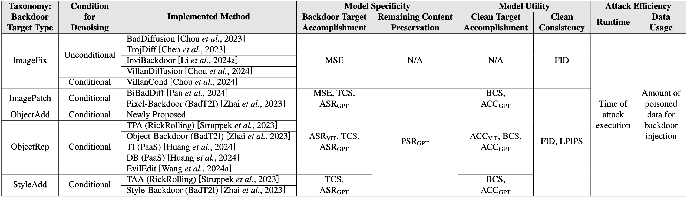

# BackdoorDM: A Comprehensive Benchmark for Backdoor Learning in Diffusion Model

BackdoorDM is the first comprehensive benchmark designed for backdoor learning research in diffusion models (DMs), which owns the following features:

- **SOTA Methods Integration:** A comprehensive benchmark integrating 9 backdoor attack methods, 4 backdoor defense methods, and 2 analysis tools in DMs to facilitate the research.
  - 9 backdoor attack methods:  [BadDiffusion](./attack/uncond_gen/bad_diffusion/bad_diffusion.py), [TrojDiff](./attack/uncond_gen/trojdiff/trojdiff.py), VillanDiffusion ([uncondition](./attack/uncond_gen/villan_diffusion/villan_diffusion.py))([condition](./attack/t2i_gen/villan_diffusion_cond/villan_cond.py)), [InviBackdoor](./attack/uncond_gen/invi_backdoor/invi_backdoor.py), [BiBadDiff](./attack/t2i_gen/bibaddiff/main.py), RickRolling([TPA](./attack/t2i_gen/rickrolling/rickrolling_TPA.py))([TAA](./attack/t2i_gen/rickrolling/rickrolling_TAA.py)), BadT2I([Pixel-Backdoor](./attack/t2i_gen/badt2i/badt2i_pixel.py))([Object-Backdoor](./attack/t2i_gen/badt2i/badt2i_object.py))([Style-Backdoor](./attack/t2i_gen/badt2i/badt2i_style.py)), PaaS([TI](./attack/t2i_gen/paas/paas_ti.py))([DB](./attack/t2i_gen/paas/paas_db.py)), [EvilEdit](./attack/t2i_gen/eviledit/eviledit.py).
  - 4 backdoor defense methods: [Text Perturbations Defense](./defense/input_level/textual_perturbation/textual_perturbation.py), [Elijah](./defense/model_level/Elijah/elijah.py), [TERD](./defense/input_level/Terd_input/terd_input.py), [T2IShield](./defense/model_level/t2ishield/t2ishield.py).
  - 2 analysis tools: [Assimilation Phenomenon](./analysis/assimilation/assimilation.py), [Activation Norm](./analysis/activations/activations.py).
- **Systematic Taxonomy:** A systematic classification and precise formulation of various backdoor attack types and target types in DMs, clearly defining the research scope in this field.
- **Novel Evaluation Method:** Integration of the current evaluation metrics and further propose a unified backdoor evaluation method using [GPT-4o](./evaluation/mllm_eval.py), which provides detailed image-level evaluation on both *model specificity* and *model utility*.
- **Key Findings:** New findings from the SOTA backdoor attacks of different target types, aiming to inspire future research.

We hope that BackdoorDM can help address current challenges in the backdoor learning research and contribute to building a trustworthy DMs community.

___

### Table of Contents

- [Quick Start](#quick-start)
  - [Installation](#installation)
  - [Attack](#attack)
  - [Defense](#defense)
  - [Evaluation](#evaluation)
  - [Visualization analysis](#visualization-analysis)
- [Supported attacks](#supported-attacks)
- [Supported defenses](#supported-defenses)
- [Analysis tools](#analysis-tools)
- [Evaluation metrics for different target types](#evaluation-metrics-for-different-target-types)
<!-- - [Citation](#citation) -->

___


## Quick Start

### Installation

```bash
# Clone the code repository.
git clone https://github.com/linweiii/BackdoorDM.git
cd ./BackdoorDM
# (optional) Install the environment. 
conda env create -f environment.yml
conda activate backdoordm
```

### Attack
Since the backdoor targets are diverse and complex in DMs, in this project, we separate the training and evaluation, i.e., no evaluation is conducted during the attack process. All attacked results (including model weights and logs) are stored in `./results` folder.

We provide an attack example for [EvilEdit](./attack/t2i_gen/eviledit/eviledit.py), which is classified as `ObjectRep`:
1. **Set the config files** under the corresponding folder. `base_config.yaml` contains the basic setting (e.g., model, result folder, training dataset...). `bd_config_[target type].yaml` contains the target-specific setting for each attack (e.g., trigger, target...). The config files are stored distributedly based on different attack forms:
    ```
    |-- attack
      |-- t2i_gen
        |-- configs
          |-- base_config.yaml
          |-- bd_config_objectRep.yaml
        |-- eviledit
          |-- eviledit.py
      |-- uncond_gen
    ```
    > Note that the specified values from command line are prior and can overwrite the ones in config files.

2. **Run the attack.** After setting the configs, you can run one specific attack via command line or use the scripts as one-click run for all attacks with the same target.
    ```bash
    # Attack example
    python ./attack/t2i_gen/eviledit/eviledit.py \
      --base_config 'attack/t2i_gen/configs/base_config.yaml' \
      --bd_config 'attack/t2i_gen/configs/bd_config_objectRep.yaml' \
      --model_ver 'sd15' \
      --device 'cuda:0'
    ```
    ```bash
    # One-click run: run all the supported objectRep attacks.
    bash ./scripts/run_attack_objectRep.sh
    ```
3. **Attack results** are stored in the `./results` folder, which can be further used in `Evaluation` or `Defense`. The attacked result folder is named as `[attack method]_[model version]`:
    ```
    |-- results
      |-- eviledit_sd15
        |-- train_logs       # Store the training logs.
        |-- eviledit_*.pt    # Attacked model checkpoint.
    ```


### Defense
We classify the current defense methods into `input-level` and `model-level`. Here, we provide an model-level example [T2Ishield](./defense/model_level/t2ishield/t2ishield.py), which is applicable for all text-to-image attacks.

1. **Set backdoored model path.** You are encouraged to set the path of the backdoored model first in [`backdoored_model_path_dict`](./evaluation/configs/bdmodel_path.py) under `./evaluation/configs/bdmodel_path.py` file, which can also be used for evaluation. For example,
    ```
    'eviledit': 'eviledit_trigger-beautifuldog_target-cat.pt'
    ```

2. **Run the defense.** You can run defense for one specific attack via command line or use the scripts as one-click run for all attacks.
    ```bash
    # Defense example
    python ./attack/t2i_gen/eviledit/eviledit.py \
        --base_config 'attack/t2i_gen/configs/base_config.yaml' \
        --bd_config 'attack/t2i_gen/configs/bd_config_objectRep.yaml' \
        --model_ver 'sd15' \
        --device 'cuda:0'
    ```
    ```bash
    # One-click run: run all the supported objectRep attacks.
    bash ./scripts/run_attack_objectRep.sh
    ```

3. **Defense results** are stored in `defense` folder under the specific attacked results. Similar to attack results, the evaluation need to be conducted explicitly.

    ```
    |-- results
      |-- eviledit_sd15
        |-- defense            
          |-- t2ishield         # For T2IShield only.
            |-- defense_logs    # Store the defense logs.
            |-- defended_model  # Defended model checkpoint.
    ```

### Evaluation
**Evaluation with traditional method.** All metrics except for the GPT-related ones are evaluated in [main_eval.py](./evaluation/main_eval.py).

1. **Set backdoored model path and config files.** You are encouraged to set the path of the backdoored model first in [`backdoored_model_path_dict`](./evaluation/configs/bdmodel_path.py) under `./evaluation/configs/bdmodel_path.py` file, and also set the evaluation config file [eval_config*.yaml](./evaluation/configs/eval_config.yaml). For example, setting the backdoored model path for EvilEdit:
    ```
    'eviledit': 'eviledit_trigger-beautifuldog_target-cat.pt'
    ```

2. **Run the evaluation.** You can evaluate one specific metric for a backdoored model via command line or use the scripts as one-click run for all related results.
    ```bash
    # Evaluation example for ACC and ASR using ViT
    python ./evaluation/main_eval.py \
      --metric 'ACCASR' \
      --backdoor_method 'eviledit' \
      --device 'cuda:0'
    ```
    ```bash
    # One-click run: run all supported evaluation on ACC and ASR.
    bash ./scripts/run_eval_t2i_ACCASR.sh
    ```

3. **Evaluation results.** All tradictional evaluation results and logs are saved in `eval_results.csv` and `eval_logs` under the attacked results folder.

**Evaluation with MLLM (GPT-4o).**
$ASR_{GPT}$, $PSR_{GPT}$ for `model specificity`, and $ACC_{GPT}$ for `model utility` are evaluated in [mllm_eval.py](./evaluation/mllm_eval.py). The evaluation configs are the same as above.

```bash
# Evaluation example with MLLM
python ./evaluation/mllm_eval.py \
    --backdoor_method 'eviledit' \
    --model_ver 'sd15' \
    --device 'cuda:0'
```
```bash
# One-click run: run all supported mllm evaluation.
bash ./scripts/run_eval_mllm.sh
```
The mllm evaluation results are stored in `eval_mllm` under the attacked results folder.

### Visualization analysis

We provide two visualization analysis tools [Assimilation Phenomenon](./analysis/assimilation/assimilation.py) and [Activation Norm](./analysis/activations/activations.py). Note that assimilation analysis can only be applied to T2I models.

1. **Set backdoored model path and config files.** You are encouraged to set the path of the backdoored model first in [`backdoored_model_path_dict`](./evaluation/configs/bdmodel_path.py) under `./evaluation/configs/bdmodel_path.py` file, and also set the evaluation config file [eval_config*.yaml](./evaluation/configs/eval_config.yaml). 

2. **Run the analysis.** For *assimilation phenomenon*, you need to specify the prompts you want to use to analyze the model. Otherwise, the prompts will be chosen from the dataset randomly. For example, for EvilEdit:

   ```bash
   # Assimilation visualization example
   python ./analysis/assimilation/assimilation.py \
       --backdoor_method 'eviledit' \
       --result_dir 'eviledit_sd15' \
       --clean_prompts 'a dog sitting on the sofa' \
       --bd_prompts 'a beaytiful dog sitting on the sofa' \
       --device 'cuda:0'
   ```

   *Activation norm* analysis can be applied to both unconditional models and T2I models. For unconditional models, we hook the convolutional layers by default (65 convolutional layers in total). For T2I models, we hook the FFN layers by default (16 FFN layers in total). 

   For unconditional models, we take BadDiffusion for example:

   ```bash
   # Activation norm visualization example (hook the first three layers)
   python ./analysis/activations/activations.py \
       --backdoor_method 'baddiffusion' \
       --result_dir 'baddiffusion_DDPM-CIFAR10-32' \
       --timesteps 1000 \
       --plot_timesteps [199, 399, 599, 799, 999] \
       --selected_layers [0, 1, 2] \  
       --device 'cuda:0'
   ```

   For T2I models, we take EvilEdit for example:

   ```bash
   # Activation norm visualization example (hook the first two layers)
   python ./analysis/activations/activations.py \
       --backdoor_method 'eviledit' \
       --result_dir 'eviledit_sd15' \
       --clean_prompts 'a dog sitting on the sofa' \
       --bd_prompts 'a beaytiful dog sitting on the sofa' \
       --timesteps 51 \
       --plot_timesteps [9, 19, 29, 39, 49] \
       --selected_layers [0, 1] \  
       --device 'cuda:0'
   ```

3. **Visualization results** (figures) are stored in `analysis` folder under the specific attacked results. 

## Supported attacks

**Note:** The methods implemented in this project (including attacks, defenses, and visualization) are adapted from the official code repositories.

| Method name     | File name                                                    | Paper                                                        |
| --------------- | ------------------------------------------------------------ | ------------------------------------------------------------ |
| BadDiffusion    | [bad_diffusion.py](./attack/uncond_gen/bad_diffusion/bad_diffusion.py) | [How to Backdoor Diffusion Models?](https://openaccess.thecvf.com/content/CVPR2023/papers/Chou_How_to_Backdoor_Diffusion_Models_CVPR_2023_paper.pdf), CVPR 2023 |
| TrojDiff        | [trojdiff.py](./attack/uncond_gen/trojdiff/trojdiff.py)      | [TrojDiff: Trojan Attacks on Diffusion Models with Diverse Targets](https://openaccess.thecvf.com/content/CVPR2023/papers/Chen_TrojDiff_Trojan_Attacks_on_Diffusion_Models_With_Diverse_Targets_CVPR_2023_paper.pdf), CVPR 2023 |
| VillanDiffusion | [villan_diffusion.py](./attack/uncond_gen/villan_diffusion/villan_diffusion.py), [villan_cond.py](./attack/t2i_gen/villan_diffusion_cond/villan_cond.py) | [VillanDiffusion: A Unified Backdoor Attack Framework for Diffusion Models](https://papers.nips.cc/paper_files/paper/2023/file/6b055b95d689b1f704d8f92191cdb788-Paper-Conference.pdf), NeurIPS 2023 |
| InviBackdoor    | [invi_backdoor.py](./attack/uncond_gen/invi_backdoor/invi_backdoor.py) | [Invisible Backdoor Attacks on Diffusion Models](https://arxiv.org/pdf/2406.00816), Arvix 2024 |
| BiBadDiff       | [main.py](./attack/t2i_gen/bibaddiff/main.py)                                                            | [From Trojan Horses to Castle Walls: Unveiling Bilateral Data Poisoning Effects in Diffusion Models](https://openreview.net/pdf?id=yiXZZC5qDI), NeurIPS 2024 |
| RickRolling     | [rickrolling_TPA.py](./attack/t2i_gen/rickrolling/rickrolling_TPA.py), [rickrolling_TAA.py](./attack/t2i_gen/rickrolling/rickrolling_TAA.py) | [Rickrolling the Artist: Injecting Backdoors into Text Encoders for Text-to-Image Synthesis](https://openaccess.thecvf.com/content/ICCV2023/papers/Struppek_Rickrolling_the_Artist_Injecting_Backdoors_into_Text_Encoders_for_Text-to-Image_ICCV_2023_paper.pdf), ICCV 2023 |
| BadT2I          | [badt2i_pixel.py](./attack/t2i_gen/badt2i/badt2i_pixel.py), [badt2i_object.py](./attack/t2i_gen/badt2i/badt2i_object.py), [badt2i_style.py](./attack/t2i_gen/badt2i/badt2i_style.py) | [Text-to-Image Diffusion Models can be Easily Backdoored through Multimodal Data Poisoning](https://dl.acm.org/doi/10.1145/3581783.3612108), MM 2023 |
| PaaS            | [paas_ti.py](./attack/t2i_gen/paas/paas_ti.py), [paas_db.py](./attack/t2i_gen/paas/paas_db.py) | [Personalization as a Shortcut for Few-Shot Backdoor Attack against Text-to-Image Diffusion Models](https://ojs.aaai.org/index.php/AAAI/article/view/30110), AAAI 2024 |
| EvilEdit        | [eviledit.py](./attack/t2i_gen/eviledit/eviledit.py)         | [EvilEdit: Backdooring Text-to-Image Diffusion Models in One Second](https://openreview.net/pdf/23dd30496fc6bd3df9357c40530dd5d0759e670f.pdf), MM 2024 |

## Supported defenses 

| Method name                   | File name                                                    | Paper                                                        |
| :---------------------------- | :----------------------------------------------------------- | :----------------------------------------------------------- |
| Textual Perturbations Defense | [textual_perturbation.py](./defense/input_level/textual_perturbation/textual_perturbation.py) | [Defending Text-to-image Diffusion Models: Surprising Efficacy of Textual Perturbations Against Backdoor Attacks](https://openreview.net/pdf/8e3107fb7c2e6e21e926022c7594944c216c8c87.pdf), ECCV 2024 workshop |
| Elijah                        | [elijah.py](./defense/model_level/Elijah/elijah.py)          | [Elijah: Eliminating Backdoors Injected in Diffusion Models via Distribution Shift](https://dl.acm.org/doi/abs/10.1609/aaai.v38i10.28958), AAAI 2024 |
| TERD                          | [terd_input.py](./defense/input_level/Terd_input/terd_input.py) | [TERD: A Unified Framework for Safeguarding Diffusion Models Against Backdoors](https://dl.acm.org/doi/10.5555/3692070.3693533), ICML 2024 |
| T2IShield                     | [t2ishield.py](./defense/model_level/t2ishield/t2ishield.py) | [T2IShield: Defending Against Backdoors on Text-to-Image Diffusion Models](https://dl.acm.org/doi/10.1007/978-3-031-73013-9_7), ECCV 2024 |

## Analysis tools


| File name                                                  | Method                                                       | Referred code                                                |
| :--------------------------------------------------------- | :----------------------------------------------------------- | :----------------------------------------------------------- |
| [assimilation.py](./analysis/assimilation/assimilation.py) | Assimilation Phenomenon. Proposed in [T2IShield](https://dl.acm.org/doi/10.1007/978-3-031-73013-9_7), aiming to observe the backdoor behavior from attention map of cross-attention layer. | https://github.com/Robin-WZQ/T2IShield/blob/main/backdoor_detection/visualization/Assimilation%20Phenomenon%20Visualization.ipynb |
| [activations.py](./analysis/activations/activations.py)    | Activation Norm. Proposed in [ConceptPrune](https://arxiv.org/pdf/2405.19237v1), aiming to observe the neuron behavior with different inputs. We adapt it to observe the differences in neuron activations with poisoned and clean inputs. | https://github.com/ruchikachavhan/concept-prune/tree/main/neuron_receivers |

## Evaluation metrics for different target types

We evaluate the attack performance in terms of `model specificity`, `model utility`, and `attack efficiency`. Each target type of the defined taxonomy can be evaluated and compared under the same criteria:



<!-- ## Citation

If you find it helpful, please cite our papers:

```

``` -->